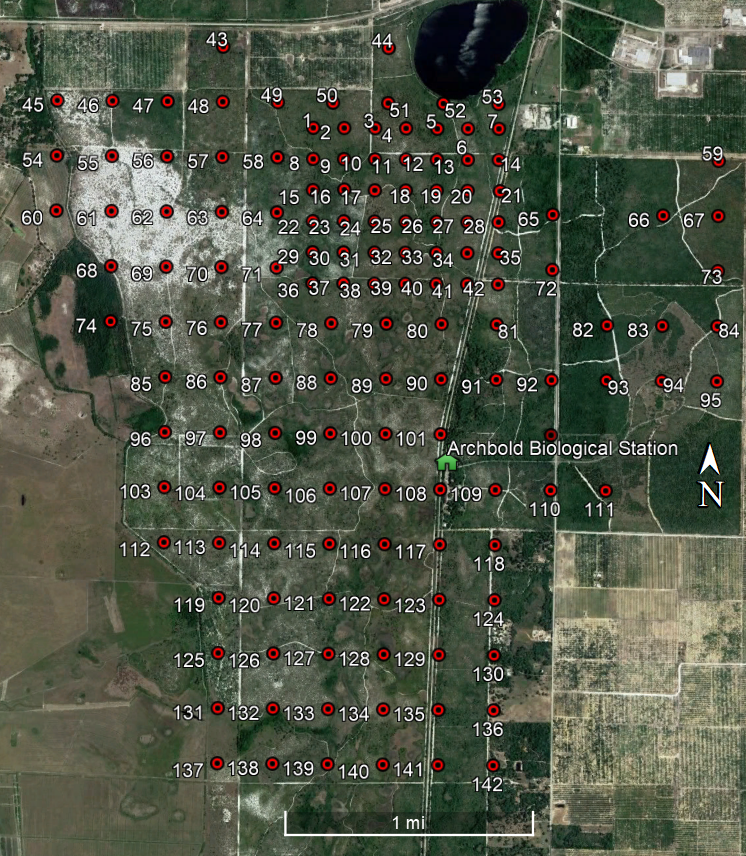

Weekly reports for sensor station 1
================
Young
11/23/2020

### Load functions and packages

``` r
source("functions/data_manager.R")
source("functions/node_health.R")
library(readxl)
library(tidyverse)
library(stringr)
library(knitr)
library(lubridate)
```

<br>

#### Set up

Infile needs to be updated based on data that has been downloaded from
CTT account weekly. Set time accordingly.

Load data from `datafiles`.

``` r
infile_oct27 <- "C:/Users/Young/OneDrive/Documents/CTTdata/CTT_data_tools/datafiles/Oct27-Nov2/" 

# Set frequency
freq_node <-"30 min"

# Load list of deployed nodes
node_list <- read.csv("nodes.csv")
node_list <- node_list %>% 
  select(NodeId, id)
```

Set day of interest - can this report be generated everyday
automatically? Set today or particular time point.

Load data

``` r
all_data <- load_data(infile_oct27) 

beep_data <- all_data[[1]]
#beep_data <- beep_data[complete.cases(beep_data), ]

health_data <- all_data[[2]]
#health_data now has a data frame of all of your node health files. 

gps_data <- all_data[[3]]
```

<br>

### Node health

Table of nodes and their performance. For v2 nodes only.

| Variable      | Description                                                     |
| ------------- | --------------------------------------------------------------- |
| id            | Numerical ID of where the node is on the map                    |
| maxRSSI       | Maximum RSSI for the designated time period                     |
| minRSSI       | Minimum RSSI for the designated time period                     |
| maxbattery    | Maximum voltage of battery when fully charged, ideally above 4V |
| minbattery    | Minimum voltage of battery when fully charged                   |
| checkins      | Total count of checkins during designated time period           |
| batterystatus | Notes if maximum battery voltage is below 3.7                   |
| checkinstatus | Notes if check-in count is below 100                            |

``` r
health_df <- health_data[[1]]
nodes_health <- unique(health_df$NodeId)

health_df <- health_df %>% 
  left_join(node_list, by="NodeId")

health_df %>% 
  select(NodeId, id, RadioId, Time, NodeRSSI, Battery, Latitude, Longitude) %>%
  group_by(NodeId, id) %>%
  summarise(maxRSSI = max(NodeRSSI),
            minRSSI = min(NodeRSSI),
            maxbattery = max(Battery),
            minbattery = min(Battery),
            checkins = n(),
            batterystatus = ifelse(maxbattery < 3.7, "< 3.7", ""),
            checkinstatus = ifelse(checkins < 100, "< 100", "")) %>% 
  filter(id != "NA") %>% #filter out nodes that don't match 
  kable()
```

    ## `summarise()` regrouping output by 'NodeId' (override with `.groups` argument)

| NodeId |  id | maxRSSI | minRSSI | maxbattery | minbattery | checkins | batterystatus | checkinstatus |
| :----- | --: | ------: | ------: | ---------: | ---------: | -------: | :------------ | :------------ |
| 325ADD |  94 |    \-69 |   \-106 |       3.82 |       3.70 |     1069 |               |               |
| 325D04 |  43 |    \-64 |   \-101 |       3.84 |       3.73 |     1237 |               |               |
| 325D05 | 103 |    \-96 |   \-106 |       3.84 |       3.80 |        3 |               | \< 100        |
| 325DAD | 115 |    \-51 |   \-106 |       3.97 |       3.87 |     1937 |               |               |
| 325EC5 |  78 |    \-64 |   \-107 |       3.96 |       3.86 |     1245 |               |               |
| 325EDA |  90 |    \-56 |   \-106 |       3.51 |       3.51 |     1141 | \< 3.7        |               |
| 325F9A | 101 |    \-68 |   \-107 |       3.59 |       3.50 |     2606 | \< 3.7        |               |
| 326016 |  87 |    \-66 |   \-107 |       3.93 |       3.84 |      712 |               |               |
| 326047 |  81 |    \-64 |   \-107 |       3.83 |       3.51 |      628 |               |               |
| 3260A2 | 131 |    \-79 |   \-107 |       3.56 |       3.50 |      197 | \< 3.7        |               |
| 326250 | 142 |    \-78 |   \-107 |       3.94 |       3.88 |      251 |               |               |
| 3262F4 | 136 |    \-64 |   \-106 |       3.85 |       3.78 |     1746 |               |               |
| 32636B |  48 |    \-53 |    \-99 |       3.89 |       3.82 |     1299 |               |               |
| 32641D |   3 |    \-73 |   \-107 |       3.88 |       3.81 |      607 |               |               |
| 3264F2 | 129 |    \-64 |   \-106 |       3.78 |       3.65 |      871 |               |               |
| 326547 |  50 |    \-79 |   \-106 |       3.59 |       3.50 |     1045 | \< 3.7        |               |
| 326638 | 135 |    \-56 |   \-108 |       3.54 |       3.50 |      507 | \< 3.7        |               |
| 326647 |  40 |    \-67 |   \-106 |       3.57 |       3.50 |     1144 | \< 3.7        |               |
| 326660 |  92 |    \-65 |   \-106 |       3.52 |       3.50 |      903 | \< 3.7        |               |
| 32671B |  62 |    \-63 |   \-102 |       3.93 |       3.85 |     1259 |               |               |
| 32675E |  93 |    \-58 |   \-108 |       3.57 |       3.50 |      746 | \< 3.7        |               |
| 3267DB | 121 |    \-64 |   \-107 |       3.87 |       3.79 |     1189 |               |               |
| 3275B8 |  74 |    \-64 |   \-107 |       3.62 |       3.51 |      489 | \< 3.7        |               |
| 327710 |  85 |    \-62 |   \-101 |       3.63 |       3.51 |      605 | \< 3.7        |               |
| 327727 |  86 |    \-76 |   \-106 |       3.82 |       3.69 |     1077 |               |               |
| 32783E |  58 |    \-55 |    \-96 |       3.85 |       3.75 |     1234 |               |               |
| 327966 |  71 |    \-20 |   \-108 |       3.96 |       3.86 |      642 |               |               |
| 327998 |  42 |    \-63 |   \-108 |       3.96 |       3.88 |      629 |               |               |
| 327A47 | 119 |    \-64 |   \-102 |       3.96 |       3.84 |      620 |               |               |
| 327A84 |  96 |    \-70 |   \-101 |       3.88 |       3.81 |      540 |               |               |
| 327AA0 |  99 |    \-64 |   \-103 |       3.77 |       3.67 |     2079 |               |               |
| 327F03 |  51 |    \-60 |   \-104 |       3.53 |       3.51 |     1095 | \< 3.7        |               |
| 327F6F | 124 |    \-17 |   \-104 |       3.60 |       3.49 |     2001 | \< 3.7        |               |
| 328049 |  98 |    \-55 |   \-107 |       4.04 |       3.88 |     1092 |               |               |
| 3280CF |  91 |    \-64 |   \-107 |       3.58 |       3.50 |     1489 | \< 3.7        |               |
| 32814C |  70 |    \-79 |   \-107 |       3.60 |       3.50 |      745 | \< 3.7        |               |
| 3283A1 | 116 |    \-64 |   \-108 |       3.89 |       3.81 |     1963 |               |               |
| 32842B | 122 |    \-78 |   \-107 |       4.02 |       3.88 |     1630 |               |               |
| 328457 | 106 |    \-64 |   \-106 |       3.54 |       3.50 |      261 | \< 3.7        |               |
| 3284B4 |  55 |    \-64 |   \-107 |       3.82 |       3.69 |     1111 |               |               |
| 328557 | 110 |    \-60 |   \-107 |       3.91 |       3.85 |     1883 |               |               |
| 32855D | 141 |    \-64 |   \-105 |       3.60 |       3.50 |      446 | \< 3.7        |               |
| 32859E | 130 |    \-64 |   \-102 |       3.59 |       3.50 |     1921 | \< 3.7        |               |
| 328666 |  75 |    \-85 |   \-107 |       3.54 |       3.50 |      292 | \< 3.7        |               |
| 32866A |  72 |    \-64 |   \-107 |       3.54 |       3.50 |     1360 | \< 3.7        |               |
| 328722 | 123 |    \-59 |   \-107 |       3.86 |       3.74 |      597 |               |               |
| 328733 |  47 |    \-76 |   \-107 |       3.62 |       3.54 |      722 | \< 3.7        |               |
| 328762 |  59 |    \-65 |   \-105 |       3.58 |       3.49 |      547 | \< 3.7        |               |
| 328790 |  63 |    \-63 |   \-105 |       3.56 |       3.50 |     1221 | \< 3.7        |               |
| 328877 | 108 |    \-64 |   \-107 |       3.59 |       3.49 |     2449 | \< 3.7        |               |
| 32887D | 118 |    \-64 |   \-107 |       3.86 |       3.72 |     2760 |               |               |
| 328A02 | 111 |    \-64 |   \-107 |       3.88 |       3.79 |     1140 |               |               |
| 328A63 |  49 |    \-78 |   \-107 |       3.62 |       3.52 |      533 | \< 3.7        |               |
| 328AC4 |  79 |    \-52 |   \-107 |       3.49 |       3.49 |     1594 | \< 3.7        |               |
| 328AFC |  56 |    \-80 |   \-102 |       3.68 |       3.55 |     1228 | \< 3.7        |               |
| 328B94 | 140 |    \-87 |   \-106 |       3.59 |       3.50 |       99 | \< 3.7        | \< 100        |
| 328B9F |  61 |    \-61 |   \-102 |       3.93 |       3.83 |     1235 |               |               |
| 328C20 |  69 |    \-64 |    \-95 |       3.58 |       3.50 |      563 | \< 3.7        |               |
| 328C41 |  97 |    \-64 |   \-107 |       4.05 |       3.94 |      994 |               |               |
| 328C82 | 104 |    \-77 |   \-106 |       3.59 |       3.50 |      372 | \< 3.7        |               |
| 328D7D | 133 |    \-74 |   \-107 |       3.57 |       3.51 |       44 | \< 3.7        | \< 100        |
| 329074 |  80 |    \-64 |    \-99 |       3.77 |       3.67 |     1222 |               |               |
| 3290AE |   8 |    \-64 |    \-95 |       3.88 |       3.79 |     1212 |               |               |
| 3291D9 | 120 |    \-64 |   \-107 |       3.87 |       3.80 |     1761 |               |               |
| 329416 |  44 |    \-65 |   \-102 |       3.86 |       3.76 |      601 |               |               |
| 3296F3 |  38 |    \-64 |    \-95 |       3.86 |       3.73 |     1219 |               |               |
| 329855 | 139 |    \-64 |   \-106 |       3.91 |       3.84 |      198 |               |               |
| 3298A5 | 125 |    \-80 |   \-101 |       3.88 |       3.81 |      526 |               |               |
| 329914 | 117 |    \-64 |   \-104 |       3.58 |       3.50 |     1267 | \< 3.7        |               |
| 3299F0 | 137 |    \-80 |   \-107 |       3.58 |       3.50 |      408 | \< 3.7        |               |
| 329B14 | 105 |    \-64 |   \-107 |       3.62 |       3.49 |      623 | \< 3.7        |               |
| 329D42 | 128 |    \-52 |   \-108 |       3.88 |       3.77 |     1518 |               |               |
| 329F69 |  65 |    \-64 |   \-105 |       3.95 |       3.85 |      479 |               |               |
| 32A459 |  68 |    \-64 |   \-104 |       3.73 |       3.66 |     1148 |               |               |
| 32AFE9 |  24 |    \-71 |   \-103 |       3.92 |       3.83 |     2069 |               |               |
| 32B651 |  77 |    \-64 |   \-108 |       3.86 |       3.74 |     1364 |               |               |
| 32B664 |  54 |    \-83 |   \-107 |       3.58 |       3.50 |      115 | \< 3.7        |               |
| 32B772 | 102 |    \-83 |   \-106 |       3.61 |       3.50 |      271 | \< 3.7        |               |
| 32B7D7 |  89 |    \-75 |   \-105 |       3.54 |       3.50 |     1097 | \< 3.7        |               |
| 32B7FA |  45 |    \-64 |   \-102 |       3.56 |       3.50 |     1174 | \< 3.7        |               |
| 32B87B | 134 |    \-64 |   \-106 |       3.83 |       3.70 |     1781 |               |               |
| 32B87D |  76 |    \-65 |   \-101 |       3.98 |       3.87 |      613 |               |               |
| 32B8B9 | 126 |    \-73 |   \-102 |       3.57 |       3.49 |      604 | \< 3.7        |               |
| 32B8F9 | 100 |    \-64 |   \-108 |       4.06 |       3.98 |     2411 |               |               |

<br>



<br>

#### by hour

health\_df %\>% select(NodeId, RadioId, Time, NodeRSSI, Battery,
Latitude, Longitude) %\>% mutate(timeEST = with\_tz(Time, “EST”)) %\>%
mutate(hour = format(as.POSIXct(timeEST, format=“%H:%M:%S”), “%I %p”))
%\>% group\_by(NodeId, hour) %\>% summarise(maxRSSI = max(NodeRSSI),
minRSSI = min(NodeRSSI), maxbattery = max(Battery), minbattery =
min(Battery), checkins = n(), batterystatus = ifelse(maxbattery \< 3.7,
“\< 3.7”, "“), checkinstatus = ifelse(checkins \< 10,”\< 10“,”")) %\>%
kable()

### Daily downloads

``` r
min(health_df$Time) # start of time period
```

    ## [1] "2020-10-26 23:53:36 UTC"

``` r
max(health_df$Time) # end of time period
```

    ## [1] "2020-10-29 19:54:36 UTC"

``` r
difftime(max(health_df$Time), min(health_df$Time), units = "days")
```

    ## Time difference of 2.83402778 days

<br>

### Nodes not reporting

List of nodes not getting picked up by Sensor station 1 – B0ED7D47B60C
(one on water tower). Old nodes not included\!

``` r
reportingnodes <- health_df %>% 
  group_by(NodeId) %>% 
  summarise(count= n()) %>% 
  select(NodeId)

setdiff(node_list$NodeId, reportingnodes$NodeId) %>% kable()
```

| x        |
| :------- |
| BC       |
| 4BB      |
| 41C      |
| 419      |
| A3       |
| AB       |
| 4D9      |
| C3       |
| D3       |
| A6       |
| C7       |
| D6       |
| AC       |
| C0       |
| 425      |
| 42A      |
| D2       |
| 4BD      |
| 4B2      |
| 3.28E+08 |
| B7       |
| 496      |
| 4C6      |
| D4       |
| AF       |
| CD       |
| B8       |
| C8       |
| 4BC      |
| 4C0      |
| C4       |
| 4BA      |
| A1       |
| B2       |
| BD       |
| AE       |
| 328F49   |
| 326747   |
| 329657   |
| 328FB8   |
| 3280B1   |
| 327904   |
| 326505   |
| 3262BC   |
| 32673E   |
| 327FDE   |
| 328DD4   |
| 32B8B7   |
| 3285D7   |
| 325D56   |
| 100120   |
| 3.28E+61 |
| 32AEC9   |
| 328E8C   |
| 3.29E+63 |
| 32260C   |
| 32658E   |
| 32629F   |

<br>

### Tag stats

### Base station stats
